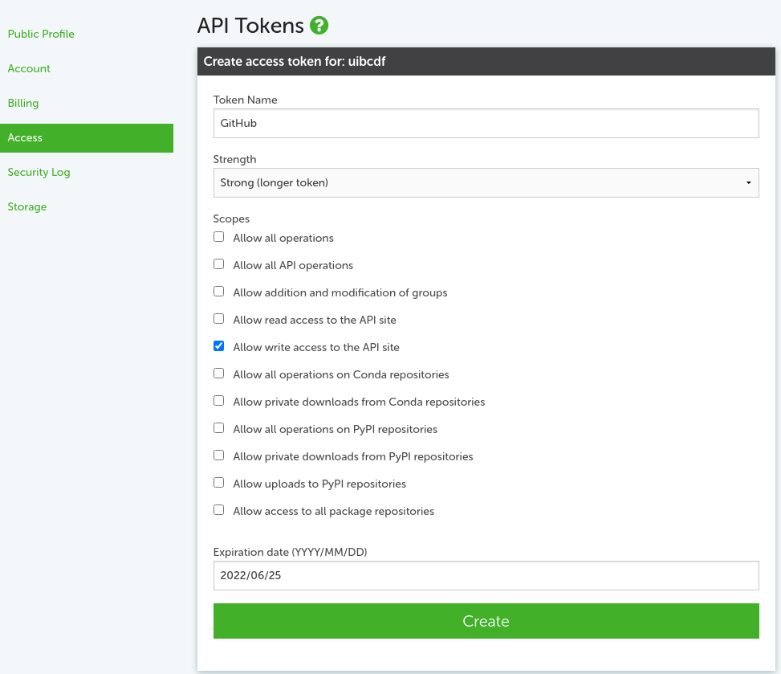

[conda-build-recipe]: https://docs.conda.io/projects/conda-build/en/stable/concepts/recipe.html
[UIBCDF]: https://www.uibcdf.org/
[anaconda.org]: https://anaconda.org/
[GitHub workflow]: https://docs.github.com/en/actions/writing-workflows/about-workflows
[conda-build-command]: https://docs.conda.io/projects/conda-build/en/stable/resources/commands/conda-build.html
[conda-convert-command]: https://docs.conda.io/projects/conda-build/en/stable/resources/commands/conda-convert.html
[anaconda-upload-command]: https://docs.anaconda.com/anaconda-repository/commandreference/#upload

# action-build-and-upload-conda-packages
[](https://github.com/ellerbrock/open-source-badges/)
[](https://opensource.org/licenses/MIT)

:gear: **Build your conda package**<br>
:arrows_counterclockwise: **Convert your conda package**<br>
:rocket: **Upload your conda package**<br>
:white_check_mark: **Completely automated!!**<br>

## Content
- [About](#about)
- [Requirements](#requirements)
  - [Conda-build recipe](#conda-build-recipe)
  - [Conda base environment](#conda-base-environment)
  - [Anaconda token](#anaconda-token)
    - [Create an Anaconda token](#create-an-anaconda-token)
      - [Using the command line](#using-the-command-line)
      - [Through the Anaconda.org website](#through-the-anacondaorg-website)
    - [Add the Anaconda token to the GitHub Secrets](#add-the-anaconda-token-to-the-github-secrets)
- [How to use](#how-to-use)
- [Input parameters](#input-parameters)
  - [Additional command line arguments](#additional-command-line-arguments)
- [Outputs](#outputs)
- [Examples](#examples)
- [Acknowledgements](#acknowledgements)

## About
This GitHub Action automates the process of building, converting, and uploading _Conda_ packages to [Anaconda.org]. It streamlines package distribution by handling:

- Building: Uses `conda build` to create _Conda_ packages from a [_conda-build_ recipe][conda-build-recipe].
- Converting: Utilizes `conda convert` to generate platform-specific package variants.
- Uploading: Publishes the final package versions to [Anaconda.org] for easy distribution.

By integrating this action into your [CI/CD GitHub workflow][GitHub workflow], you can ensure that your _Conda_ packages are consistently built, transformed for multiple platforms, and made available to your users with minimal manual effort.

This GitHub Action was originally developed by the [Computational Biology and Drug Design Research Unit (UIBCDF) at the
Mexico City Children's Hospital Federico Gómez][UIBCDF]. For the complete list of contributors, refer to the [contributors section](https://github.com/uibcdf/action-build-and-upload-conda-packages/graphs/contributors).<br>
Explore more GitHub Actions developed by UIBCDF at the [UIBCDF GitHub Organization page](https://github.com/search?q=topic%3Agithub-actions+org%3Auibcdf&type=Repositories).

## Requirements

### Conda-build recipe
A [conda-build recipe][conda-build-recipe] defines the instructions for building your package, primarily through a `meta.yaml` file, optionally accompanied by other supporting files.<br>
These files can be placed within a `.conda` directory in your repository.<br>
For details on how to structure a conda-build recipe, refer to the [_Conda_ metadata instructions](https://docs.conda.io/projects/conda-build/en/latest/resources/define-metadata.html).

### Conda base environment
This action relies on `conda` commands, which must be accessible within the GitHub runner. To ensure this, a base [_Conda_ environment](https://docs.conda.io/projects/conda/en/latest/user-guide/tasks/manage-environments.html#creating-an-environment-file-manually) needs to be set up.<br>
We recommend using the [conda-incubator/setup-miniconda](https://github.com/conda-incubator/setup-miniconda) action in a preceding step of your GitHub workflow to configure the _Conda_ base environment:

```yaml
steps:
      ...
      - name: Conda environment creation and activation
        uses: conda-incubator/setup-miniconda@v3
        with:
          python-version: 
          environment-file: path/to/conda/env.yaml # Path to the conda environment
          auto-update-conda: false
          auto-activate-base: false
          show-channel-urls: true
      ...      
      - name: Build and upload the conda packages
        uses: uibcdf/action-build-and-upload-conda-packages@v2.0.0
        ...
```

### Anaconda token

In order to upload a package to your anaconda user or organization channel, you need to [create an Anaconda token](https://docs.anaconda.com/anacondaorg/user-guide/work-with-accounts/#generating-tokens).<br>

#### Create an Anaconda token
There are two main ways to create an Anaconda token:
- [Using the command line](#using-the-command-line)
- [Through the Anaconda.org website](#through-the-anacondaorg-website)
  
##### Using the command line
You can create an Anaconda token from your terminal, using [anaconda auth](https://docs.anaconda.com/anaconda-repository/commandreference/#authentication):
```
# Replace 'MyToken' with the name you want for your token
anaconda auth --create --name MyToken
```
> [!TIP]
> To create token for an [Anaconda Organization](https://docs.anaconda.com/anacondaorg/user-guide/work-with-organizations/), add the `--org` option to the command above:
> ```
> # Replace 'MyOrg' with the name of the organization
> # Replace 'MyToken' with the name you want for your token
> anaconda auth --create --name MyToken --org MyOrg
> ```

##### Through the Anaconda.org website
1. Log in to [Anaconda.org]
2. From your profile in the top-right corner, select **Settings**.
3. Click **Access** in the left-hand menu.
4. Fill out the _Create access token_ form:
   1. Provide a unique token name.
   2. Set your token strength to `strong (longer token)`. This generates a strong, completely unique token that is difficult to guess with brute force methods.
   3. Set the required scopes for your use case.
   4. Set the expiration date.
5. Click on _Create_



> [!TIP]
> To create a token for an [Anaconda Organization](https://docs.anaconda.com/anacondaorg/user-guide/work-with-organizations/), follow the steps outlined in [Issuing/reissuing a token](https://docs.anaconda.com/psm-cloud/tokens/#issuing-reissuing-a-token).

#### Add the Anaconda token to the GitHub Secrets
The best practice for using an Anaconda token in a GitHub Action is to store it as a [GitHub Secret](https://docs.github.com/en/actions/security-for-github-actions/security-guides/using-secrets-in-github-actions). This helps keep the token secure and prevents it from being exposed in workflow logs.<br>
For instructions on creating and using GitHub Secrets, refer to [GitHub's documentation](https://docs.github.com/en/actions/security-for-github-actions/security-guides/using-secrets-in-github-actions).

## How to use

You can include this GitHub Action as a [step](https://docs.github.com/en/actions/writing-workflows/workflow-syntax-for-github-actions#jobsjob_idsteps) within a [GitHub workflow], placed in the `.github/workflows` directory within your repository.

An example of the basic usage of this GitHub Action is displayed below:

<div id="basic-example">

```yaml
name: Build and upload conda packages

on:
  push:
    branches: main

jobs:
  conda_deployment:
    name: Conda deployment
    runs-on: ubuntu-latest
    steps:
      - name: Checkout repo
        uses: actions/checkout@v4
      - name: Conda environment creation and activation
        uses: conda-incubator/setup-miniconda@v3
        with:
          python-version: 3.11
          environment-file: path/to/conda/env.yaml    # Replace with the path to your conda environment
          auto-update-conda: false
          auto-activate-base: false
          show-channel-urls: true
      - name: Build and upload the conda packages
        uses: uibcdf/action-build-and-upload-conda-packages@v2.0.0
        with:
          meta_yaml_dir: path/to/meta.yaml/directory # Replace with the path to your meta.yaml directory
          user: uibcdf # Replace with your Anaconda username (or an Anaconda organization username)
          token: ${{ secrets.ANACONDA_TOKEN }} # Replace with the name of your Anaconda Token secret
```

</div>

## Input parameters

| Name | Description | Required/Optional | Default value |
| ---------------- | ----------- | -------- | ------------- |
| `meta_yaml_dir` | Path to the directory where the `meta.yaml` file is located. | Required | |
| `upload` | Upload the built package to Anaconda. If set to `false`, the built package will not be uploaded to Anaconda.org. | Optional | `true` |
| `overwrite` |  Do not abort the uploading if a package with the same name is already present in the Anaconda channel. | Optional | `false` |
| `mambabuild` | Uses [`conda mambabuild` command](https://boa-build.readthedocs.io/en/stable/mambabuild.html) to build the packages. Requires [`mamba` setup](https://github.com/conda-incubator/setup-miniconda?tab=readme-ov-file#example-6-mamba). | Optional | `false` |
| `user` | Name of the Anaconda.org channel where the package will be uploaded. | Optional | |
| `token` | [Anaconda token](#anaconda-token) for the package uploading. | Optional |  |
| `label` | Label of the uploaded package. | Optional | `main` |
| `platform_host` | Build packages for the host platform. | Optional | `true` |
| `platform_all` | Build packages for all supported platforms. | Optional | `false` |
| `platform_linux-64` | Build packages for the `linux-64` platform. | Optional | `false` |
| `platform_linux-32` | Build packages for the `linux-32` platform. | Optional | `false` |
| `platform_osx-64` | Build packages for the `osx-64` platform. | Optional | `false` |
| `platform_osx-arm64` | Build packages for the `osx-arm64` platform. | Optional | `false` |
| `platform_linux-ppc64` | Build packages for the `linux-ppc64` platform. | Optional | `false` |
| `platform_linux-ppc64le` | Build packages for the `linux-ppc64le` platform. | Optional | `false` |
| `platform_linux-s390x` | Build packages for the `linux-s390x` platform. | Optional | `false` |
| `platform_linux-armv6l` | Build packages for the `linux-armv6l` platform. | Optional | `false` |
| `platform_linux-armv7l` | Build packages for the `linux-armv7l` platform. | Optional | `false` |
| `platform_linux-aarch64` | Build packages for the `linux-aarch64` platform. | Optional | `false` |
| `platform_win-32` | Build packages for the `linux-win-32` platform. | Optional | `false` |
| `platform_win-64` | Build packages for the `linux-win-64` platform. | Optional | `false` |
| `conda_build_args` | [Additional command line arguments](#additional-command-line-arguments) to pass to the `conda build` command. | Optional |  |
| `conda_convert_args` | [Additional command line arguments](#additional-command-line-arguments) to pass to the `conda convert` command. | Optional |  |
| `anaconda_upload_args` | [Additional command line arguments](#additional-command-line-arguments) to pass to the `anaconda upload` command. | Optional |  |

### Additional command line arguments
This action, internally, calls the following commands:
- [`conda build`][conda-build-command] (or `conda mambabuild`, if `mambabuild` is set to `true`)
- [`conda convert`][conda-convert-command] (if any platform conversion is specified)
- [`anaconda upload`][anaconda-upload-command] (if `upload` is set to `true`)

The above commands have multiple command-line arguments that can be passed, for each of the respective command, by using the `conda_build_args`, `conda_convert_args` and `anaconda_upload_args` input parameters.

Refer to the [Pass additional command-line arguments example](#pass-additional-command-line-arguments-example) for a practical case on the usage of these input parameters.

> [!WARNING]
> Some command line arguments in `conda_build_args`, `conda_convert_args` or `anaconda_upload_args` cannot be specified because they are either already handled internally by the action or conflict with specific input parameters:<br>
> **`conda_build_args`**
> - `--output-folder`
> - `--no-anaconda-upload`
> 
> **`conda_convert_args`**
> - `--output-folder`
> 
> **`anaconda_upload_args`**
> - `--label`/`-l` together with the `label` input parameter
> - `--user`/`-u` together with the `user` input parameter
> - `--force` together with the `overwrite` input parameter

## Outputs
| Name | Description | 
| --- | --- |
| paths | Space-separated paths for the built packages, in the format `path1 path2 ... pathN`. |

The output paths can be useful for later jobs, for example to [create a GitHub release with the built packages as artifacs](#create-a-gitHub-release-with-the-built-packages-as-artifacs-example).

## Examples

<!-- Example 1 -->
<details id="build-and-upload-a-package-when-a-new-git-tag-is-pushed-and-use-the-git-tag-as-the-package-version-example">
<summary><b>Build and upload a package when a new <i>Git</i> tag is pushed and use the <i>Git</i> tag as the package version</b></summary>

The `meta.yaml` file defines the [package version field](https://docs.conda.io/projects/conda-build/en/stable/resources/define-metadata.html#package-version) to specify the version number of the built package.

To automatically set the package version to the latest <i>Git</i> tag, [Jinja Templating](https://docs.conda.io/projects/conda-build/en/stable/resources/define-metadata.html#templating-with-jinja) can be used by setting the version value to `{{ GIT_DESCRIBE_TAG }}` in the `meta.yaml` file:

```yaml
# meta.yaml file
package:
  name: your_package_name # replace with your package name
  version: {{ GIT_DESCRIBE_TAG }}
```

Then, to build and upload a package whenever a new <i>Git</i> tag is pushed, your workflow yaml file can look like the following:

```yaml
# your_worfklow.yaml file
name: Build and upload conda packages when a tag gets pushed

on:
  push:
    tags: 
      - '*'

jobs:
  conda_deployment:
    name: Conda deployment
    runs-on: ubuntu-latest
    steps:
      - name: Checkout repo
        uses: actions/checkout@v4
        with:
          fetch-tags: true
      - name: Conda environment creation and activation
        uses: conda-incubator/setup-miniconda@v3
        with:
          python-version: 3.11
          environment-file: path/to/conda/env.yaml    # Replace with the path to your conda environment
          auto-update-conda: false
          auto-activate-base: false
          show-channel-urls: true
      - name: Build and upload the conda packages
        uses: uibcdf/action-build-and-upload-conda-packages@v2.0.0
        with:
          meta_yaml_dir: path/to/meta.yaml/directory # Replace with the path to your meta.yaml directory
          user: uibcdf # Replace with your Anaconda username (or an Anaconda organization username)
          token: ${{ secrets.ANACONDA_TOKEN }} # Replace with the name of your Anaconda Token secret
```

**:bulb:TIP**<br>
Version numbers including the dash character `-` are [not supported by conda-build](https://docs.conda.io/projects/conda-build/en/latest/resources/define-metadata.html#package-version). If you want to release a version like `1.0.0-beta.1`, replace it with something like `1.0.0b1`.
</details>

<!-- Example 2 -->
<details id="build-a-pure-python-conda-package-for-different-platforms-example">
<summary><b>Build a <i>pure Python</i> conda package for different platforms</b></summary>

When a package is built as pure Python library, `conda convert` can generate [packages for other platforms](https://docs.conda.io/projects/conda-build/en/latest/user-guide/tutorials/build-pkgs-skeleton.html?highlight=platform#optional-converting-conda-package-for-other-platforms).

To create packages for multiple platforms (such as 'linux-64', 'osx-64' and 'win-64`), you can use the following workflow:

```yaml
# your_worfklow.yaml file
name: Build and upload pure-python conda package for different platforms

on:
  push:
    branches:
      - main

jobs:
  conda_deployment:
    name: Conda deployment
    runs-on: ubuntu-latest
    steps:
      - name: Checkout repo
        uses: actions/checkout@v4
      - name: Conda environment creation and activation
        uses: conda-incubator/setup-miniconda@v3
        with:
          python-version: 3.11
          environment-file: path/to/conda/env.yaml    # Replace with the path to your conda environment
          auto-update-conda: false
          auto-activate-base: false
          show-channel-urls: true
      - name: Build and upload the conda packages
        uses: uibcdf/action-build-and-upload-conda-packages@v2.0.0
        with:
          meta_yaml_dir: path/to/meta.yaml/directory # Replace with the path to your meta.yaml directory
          user: uibcdf # Replace with your Anaconda username (or an Anaconda organization username)
          token: ${{ secrets.ANACONDA_TOKEN }} # Replace with the name of your Anaconda Token secret
          platform_linux-64: true
          platform_osx-64: true
          platform_win-64: true
```
</details>

<!-- Example 3 -->
<details id="build-a-platform-specific-conda-package-for-different-platforms-example">
<summary><b>Build a platform-specific conda package for different platforms</b></summary>

If a package requires platform-specific compilation instructions, `conda convert` is not a viable option.

Instead, the package can be built separately for each target platform by running multiple _Conda_ builds in parallel using the [GitHub matrix strategy](https://docs.github.com/en/enterprise-cloud@latest/actions/writing-workflows/choosing-what-your-workflow-does/running-variations-of-jobs-in-a-workflow):

```yaml
# your_worfklow.yaml file
name: Build and upload platform-specific conda packages

on:
  push:
    branches:
      - main

jobs:
  conda_deployment:
    name: Conda deployment
    runs-on: ${{ matrix.os }}
    strategy:
      matrix:
        os: [macos-latest, ubuntu-latest, windows-latest]
    steps:
      - name: Checkout repo
        uses: actions/checkout@v4
      - name: Conda environment creation and activation
        uses: conda-incubator/setup-miniconda@v3
        with:
          python-version: 3.11
          environment-file: path/to/conda/env.yaml    # Replace with the path to your conda environment
          auto-update-conda: false
          auto-activate-base: false
          show-channel-urls: true
      - name: Build and upload the conda packages
        uses: uibcdf/action-build-and-upload-conda-packages@v2.0.0
        with:
          meta_yaml_dir: path/to/meta.yaml/directory # Replace with the path to your meta.yaml directory
          user: uibcdf # Replace with your Anaconda username (or an Anaconda organization username)
          token: ${{ secrets.ANACONDA_TOKEN }} # Replace with the name of your Anaconda Token secret
```

This setup will run three jobs in parallel, building and uploading the Conda package for the `macos-latest`, `ubuntu-latest` and `windows-latest` platforms.

**:bulb:TIP**<br>
In this case, your `meta.yaml` file will likely need [preprocessing selectors](https://docs.conda.io/projects/conda-build/en/latest/resources/define-metadata.html#preprocessing-selectors) to differenciate builds across platforms.
</details>

<!-- Example 4 -->
<details id="pass-additional-command-line-arguments-example">
<summary><b>Pass additional command-line arguments</b></summary>

To build a package and limit the search for dependencies to specific Anaconda channels, the `--override-channels` and `--channel my_channel` options can be passed to the to the [conda build][conda-build-command] command.

Additionally, to display _Python_ imports for the compiled components of the built package, the `--show-imports` option can be passed to the [conda convert][conda-convert-command] command.

To apply these options when building and uploading a package, you can use the following workflow:

```yaml
# your_worfklow.yaml file
name: Build and upload conda packages with specific Anaconda channels and showing Python imports

on:
  push:
    branches:
      - main

jobs:
  conda_deployment:
    name: Conda deployment
    runs-on: ubuntu-latest
    steps:
      - name: Checkout repo
        uses: actions/checkout@v4
      - name: Conda environment creation and activation
        uses: conda-incubator/setup-miniconda@v3
        with:
          python-version: 3.11
          environment-file: path/to/conda/env.yaml    # Replace with the path to your conda environment
          auto-update-conda: false
          auto-activate-base: false
          show-channel-urls: true
      - name: Build and upload the conda packages
        uses: uibcdf/action-build-and-upload-conda-packages@v2.0.0
        with:
          meta_yaml_dir: path/to/meta.yaml/directory # Replace with the path to your meta.yaml directory
          user: uibcdf # Replace with your Anaconda username (or an Anaconda organization username)
          token: ${{ secrets.ANACONDA_TOKEN }} # Replace with the name of your Anaconda Token secret
          platform_osx-64: true
          conda_build_args: --override-chanels --channel my_channel # Replace my_channel with the name of the specific channel
          conda_convert_args: --show-imports
```
</details>

<!-- Example 5 -->
<details id="build-a-package-for-multiple-python-versions-example">
<summary><b>Build a package for multiple <i>Python</i> versions</b></summary>

The recommended approach for building packages across different _Python_ versions is to use [build variants](https://docs.conda.io/projects/conda-build/en/latest/resources/variants.html#build-variants).

This involves placing a `conda_build_config.yaml` file inside the conda recipe directory, specifying variant inputs. `conda build` will then generate a separate build for each variant.

For example, to build a package for _Python_ `2.7` and `3.5`, we can define:

```yaml
# conda_build_config.yaml file
python:
    - 2.7
    - 3.5
```

```yaml
# meta.yaml file
...
package:
    name: your_package_name # Replace with your package name
    version: package_version # Replace with your package version

requirements:
    build:
        - python
    run:
        - python
...
```

In this case, no changes are needed in the workflow file for this action. A setup similar to the [basic example](#how-to-use) will work.

</details>

<!-- Example 6 -->
<details id="build-a-package-for-multiple-python-versions-example">
<summary><b>Set the package label depending on the release type</b></summary>

```yaml
name: Build and upload conda packages with label according to release type

on:
  release:
    types: [released, prereleased]

jobs:
  conda_deployment:
    name: Conda deployment
    runs-on: ubuntu-latest
    steps:
      - name: Checkout repo
        uses: actions/checkout@v4
      - name: Conda environment creation and activation
        uses: conda-incubator/setup-miniconda@v3
        with:
          python-version: 3.11
          environment-file: path/to/conda/env.yaml    # Replace with the path to your conda environment
          auto-update-conda: false
          auto-activate-base: false
          show-channel-urls: true
      - name: Set label
        id: set-label
        shell: bash
        run: |
          if [[ "${{ github.event.action }}" == "prereleased" ]]; then
            label=dev
          else
            label=main
          echo "label=$label" >> $GITHUB_OUTPUT
      - name: Build and upload the conda packages
        uses: uibcdf/action-build-and-upload-conda-packages@v2.0.0
        with:
          meta_yaml_dir: path/to/meta.yaml/directory # Replace with the path to your meta.yaml directory
          user: uibcdf # Replace with your Anaconda username (or an Anaconda organization username)
          token: ${{ secrets.ANACONDA_TOKEN }} # Replace with the name of your Anaconda Token secret
          label: ${{ steps.set-label.outputs.label }}
```
</details>

<!-- Example 7 -->
<details id="create-a-gitHub-release-with-the-built-packages-as-artifacs-example">
<summary><b>Create a GitHub release with the built packages as artifacs</b></summary>

```yaml
name: Build and upload conda packages and create GitHub release with built packages as artifacts

on:
  push:
    tags: main

jobs:
  conda_deployment:
    name: Conda deployment
    runs-on: ubuntu-latest
    steps:
      - name: Checkout repo
        uses: actions/checkout@v4
      - name: Conda environment creation and activation
        uses: conda-incubator/setup-miniconda@v3
        with:
          python-version: 3.11
          environment-file: path/to/conda/env.yaml    # Replace with the path to your conda environment
          auto-update-conda: false
          auto-activate-base: false
          show-channel-urls: true
      - name: Build and upload the conda packages
        id: conda-build-and-upload
        uses: uibcdf/action-build-and-upload-conda-packages@v2.0.0
        with:
          meta_yaml_dir: path/to/meta.yaml/directory # Replace with the path to your meta.yaml directory
          user: uibcdf # Replace with your Anaconda username (or an Anaconda organization username)
          token: ${{ secrets.ANACONDA_TOKEN }} # Replace with the name of your Anaconda Token secret
      - name: Re-format output paths
        id: reformat-paths
        # Needed to have the correct newline-separated files format for the following release step
        run: |
            paths=$(tr ' ' '\n' <<< "${{steps.conda-build-and-upload.outputs.paths}}")
            echo "newline-separated-paths=$paths" >> $GITHUB_OUTPUT
      - name: Create GitHub release
        uses: softprops/action-gh-release@v2
        with:
            tag_name: ${{ github.ref_name }}
            name: your_release_name # Replace with the name for your release
            generate_release_notes: true
            fail_on_unmatched_files: true
            files: ${{steps.reformat-paths.outputs.newline-separated-paths}}
```
</details>

<!-- Example 8 -->
<details id="test-correctness-of-a-conda-build">
<summary><b>Test correctness of a <i>Conda</i> build</b></summary>

You can use this action in a [CI/CD workflow](https://github.com/resources/articles/devops/ci-cd) to test for errors during the conda build and conversion process, without uploading the package to Anaconda.org.

To do this, set `upload: false` as an input parameter for the action:

```yaml
name: Test conda build

on:
  pull_request:
    branches: main

jobs:
  conda_deployment:
    name: Conda deployment
    runs-on: ubuntu-latest
    steps:
      - name: Checkout repo
        uses: actions/checkout@v4
      - name: Conda environment creation and activation
        uses: conda-incubator/setup-miniconda@v3
        with:
          python-version: 3.11
          environment-file: path/to/conda/env.yaml    # Replace with the path to your conda environment
          auto-update-conda: false
          auto-activate-base: false
          show-channel-urls: true
      - name: Build and upload the conda packages
        uses: uibcdf/action-build-and-upload-conda-packages@v2.0.0
        with:
          meta_yaml_dir: path/to/meta.yaml/directory # Replace with the path to your meta.yaml directory
          user: uibcdf # Replace with your Anaconda username (or an Anaconda organization username)
          token: ${{ secrets.ANACONDA_TOKEN }} # Replace with the name of your Anaconda Token secret
          upload: false
```
</details>

## Acknowledgements

This GitHub Action was initially developed to address a specific need of the [UIBCDF] and serve as an example of an in-house GitHub Action for its researchers and students.

We extend our gratitude to the developers of the following related GitHub Actions, whose work provided valuable insights and guidance in setting up our own.

https://github.com/fdiblen/anaconda-action
https://github.com/MichaelsJP/conda-package-publish-action
https://github.com/Jegp/conda-package-publish-action
https://github.com/amauryval/publish_conda_package_action
https://github.com/elbeejay/conda-publish-action
https://github.com/maxibor/conda-package-publish-action
https://github.com/m0nhawk/conda-package-publish-action
https://github.com/fcakyon/conda-publish-action